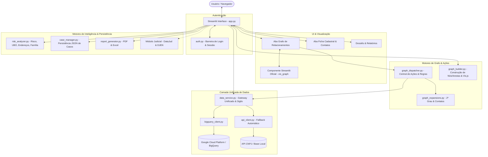

# 🍊 POMELO (CAEXLGS) — Documentação Técnica & Arquitetura do Sistema

> **Plataforma de Inteligência Societária, Redes Complexas (Grafos Interativos) e Compliance Forense.**

---

## 1. Visão Geral Executiva

O **POMELO** é uma solução de inteligência forense e patrimonial para análise e investigação de vínculos empresariais, societários e de contatos a partir dos dados públicos da Receita Federal do Brasil (RFB), combinados com motores heurísticos de risco, detecção de beneficiário final (UBO) e visualização de grafos de relacionamento em rede interativa.

A aplicação opera em dois modos principais:
1. **Modo Sigilo Total (Google BigQuery Privado):** As consultas rodam diretamente na infraestrutura GCP do próprio usuário/órgão investigador, sem que nenhum termo de busca ou documento saia do perímetro de segurança da organização.
2. **Modo Autônomo / Fallback Público:** Conexão nativa com endpoints REST da API CNPJ (`https://api.cnpj.pw`), permitindo execução imediata sem necessidade de configuração prévia de credenciais de nuvem.

---

## 2. Arquitetura do Sistema

O sistema foi concebido com separação rigorosa de responsabilidades (Clean Code / SRP):



---

## 3. Módulos do Sistema

### 3.1 `app.py` (Orquestrador da Aplicação)
* **Localização:** `C:\pomelo\cnpjpw\local_app\app.py` (e launcher raiz `C:\pomelo\app.py`).
* **Responsabilidade:** Controle de fluxo, gerenciamento de estado (`st.session_state`), renderização da barra lateral de navegação e orquestração de chamadas aos motores.
* **Telas principais:**
  * `HOME`: Busca Simples (CNPJ, Razão Social, Sócio por CPF/Nome, Telefone, E-mail).
  * `ADVANCED`: Busca Avançada com filtros múltiplos (CNAE, Município, UF, Natureza Jurídica, Capital Social, Simples/MEI).
  * `RESULTS`: Listagem de resultados encontrados com atalhos de abertura direta e em nova aba (`?cnpj=...` ou `?socio=...`).
  * `DETAILS`: Exibição detalhada com abas **🕸️ Grafo de Relacionamentos** e **📄 Ficha Cadastral**.

### 3.2 `graph_builder.py` & Componente `vis_graph` (Motor de Grafos Interativos)
* **Responsabilidade:** Gera a estrutura de dados (nós e arestas) e renderiza a rede interativa via componente customizado oficial do Streamlit (`components.declare_component`).
* **Características e Evolução:**
  * **Componente Streamlit Oficial:** Substituição da antiga bridge DOM baseada em `window.parent.document` e inputs React ocultos pelo componente bidirecional nativo em `cnpjpw/local_app/components/vis_graph/index.html`.
  * **Deduplicação de Eventos por Nonce:** Cada interação de clique gera um `nonce` criptográfico/único verificado no `st.session_state.last_processed_graph_nonce`, prevenindo reprocessamentos involuntários em *reruns* da interface.
  * **Correção de Layout e Flexbox Blowout:** Container com altura fixa controlada (`min-height: 680px; height: 680px; overflow: hidden`) e isolamento do canvas Vis.js, eliminando o colapso e redimensionamento cíclico do flexbox no Streamlit.
  * **Interatividade nos Nós:** Menu flutuante de ações nos nós com botão verde **✚** (expandir relações) e botão vermelho **✕** (excluir nó da rede). O botão de exclusão é automaticamente omitido no nó da empresa raiz.
  * **Física com Memória de Posição:** Nós arrastáveis que estabilizam e fixam suas coordenadas para evitar efeito elástico.
  * **Filtragem Estrita de Contabilidade:** Rótulo e estilo específicos para CNAE 69.20 e escritórios contábeis, com proteção contra falsos positivos.
  * **Ferramentas de Controle:** Centralização, enquadramento, zoom e exportação do grafo em imagem PNG de alta resolução.

### 3.3 `graph_dispatcher.py` (Central de Ações e Regras Semânticas do Grafo)
* **Localização:** `C:\pomelo\cnpjpw\local_app\graph_dispatcher.py`.
* **Responsabilidade:** Ponto único no backend Python responsável por validar, rotear e aplicar com idempotência qualquer ação disparada pelo usuário no grafo (botão interno, barra de ferramentas ou seletor lateral).
* **Validação Estrita:** Função `validate_graph_event` que assegura schema padronizado (`action`, `node_id`, `entity_type`, `entity_value`, `entity_label`, `feature`, `nonce`).
* **Regras Semânticas de Expansão Pontual:**
  * **Empresa (`EMPRESA` / `EMPRESA_ROOT`):** Validação estrita de 14 dígitos; bloqueio ativo de redundância da empresa raiz; busca cadastral completa e adição de sócios, telefone e e-mail diretos.
  * **Sócio / UBO (`SOCIO` / `UBO`):** Priorização de documento quando disponível e desmascarado; fallback por nome com normalização apenas na chave de cache (preservando o nome original na interface); exclusão automática da raiz dos resultados.
  * **Telefone (`TELEFONE`):** Higienização numérica com exigência mandatória de DDD explícito (10 ou 11 dígitos), eliminando fallbacks arbitrários (como presumir DDD 11); roteamento exclusivo via `data_service`.
  * **E-mail (`EMAIL`):** Normalização (`strip().lower()`) e validação sintática prévia (presença de `@` e domínio válido) antes de disparar consultas reversas.
* **Gestão de Exclusão e Restauração:**
  * Funções canônicas `exclude_graph_node`, `restore_graph_node` e `restore_all_graph_nodes`.
  * **Proteção Inviolável da Raiz:** Bloqueio ativo contra exclusão da empresa investigada em qualquer formato (`11111111000111`, com máscara, `cnpj_...`, `EMPRESA_ROOT`).
  * **Expurgo Automático de Arestas:** A exclusão de um nó purga automaticamente todas as arestas incidentes e dependentes, eliminando nós ou conexões órfãs.

### 3.4 `data_service.py` (Camada Unificada de Dados e Gestão de Sigilo)
* **Localização:** `C:\pomelo\cnpjpw\local_app\data_service.py`.
* **Responsabilidade:** Porta única de acesso a dados cadastrais e reversos, padronizando a resposta para Ficha Cadastral, Busca Simples/Avançada e Expansões do Grafo.
* **Contrato Estruturado `QueryResult`:** Retorno consistente com campos `results` (lista), `source` (`BIGQUERY`, `LOCAL_API` ou `PUBLIC_API`), `error` e `fallback_used`.
* **Detecção Robusta de BigQuery:** Suporte transparente a credenciais no Streamlit Secrets (`GCP_SERVICE_ACCOUNT_JSON` em string ou dict, `gcp_service_account`), variáveis de ambiente (`GOOGLE_APPLICATION_CREDENTIALS`) e chave de desenvolvimento local.
* **Proteção de API Pública:** Bloqueio proativo de buscas reversas por telefone e e-mail na API pública (`api.cnpj.pw`), prevenindo erros 404 e consumo desnecessário de rede.
* **Selo de Sigilo Dinâmico:** Indicador visual de `Sigilo Ativo` condicional — verde apenas quando as consultas rodam no BigQuery privado ou base local, e alerta âmbar `API Pública (Sem Sigilo)` caso contrário.

### 3.5 `graph_expansions.py` (Motores de Expansão Global em Rede)
* **Localização:** `C:\pomelo\cnpjpw\local_app\graph_expansions.py`.
* **Expandir Sócios (2º Grau):**
  * Delimitação estrita de profundidade: Grau 0 (raiz) ➔ Grau 1 (sócios diretos) ➔ Grau 2 (outras empresas desses sócios).
  * Não avança descontroladamente para grau 3 (não expande sócios das empresas de 2º grau).
  * Limite configurável (padrão 25 empresas/sócio), deduplicação por CNPJ completo e banner com sumário auditável (sócios consultados, empresas adicionadas, duplicatas descartadas e falhas).
* **Expandir Contatos da Rede:**
  * Escopo unificado e explícito: varre os telefones e e-mails válidos de todas as empresas atualmente visíveis no grafo.
  * Pré-filtragem rigorosa de telefones válidos com DDD e e-mails bem formados antes de consultar.
  * Tratamento gracioso da restrição da API pública com emissão de relatório no sumário auditável.

### 3.6 `risk_analyzer.py` (Motor Forense & Compliance)
* **Score de Risco Cadastral:** Pontuação baseada em situações atípicas (Inapta, Baixada, Suspensa, empresa aberta há menos de 1 ano, capital social desproporcional, ausência de contatos).
* **Rastreamento de UBO (Beneficiário Final):** Algoritmo recursivo que percorre a árvore de participação societária em cascata (empresas que possuem participação em outras empresas) até identificar a pessoa física controladora final.
* **Detecção de Endereços Compartilhados:** Agrupamento por CEP + número de logradouro para apontar possíveis sedes fictícias ou empresas de fachada.
* **Detecção de Grupos Familiares:** Análise de sobrenomes entre os sócios para mapear vínculos de parentesco.

### 3.7 `case_manager.py` (Persistência de Casos)
* Permite salvar e carregar projetos investigativos completos em formato `.json`.
* Preserva nós manuais criados pelo analista, arestas manuais, nós excluídos (`excluded_nodes`), anotações de parecer técnico e lista de falsos positivos desmarcados.

### 3.8 `report_generator.py` (Dossiês Executivos)
* **Dossiê em PDF:** Relatório formal pronto para instrução de processos ou relatórios de auditoria, contendo dados da matriz, quadro societário, parecer do analista, indicadores de risco e matriz de conexões.
* **Planilha em Excel (`.xlsx`):** Dados estruturados em múltiplas abas com formatação profissional.

### 3.9 `auth.py` (Autenticação e Controle de Acesso)
* **Localização:** `C:\pomelo\cnpjpw\local_app\auth.py`.
* **Responsabilidade:** Barreira obrigatória que bloqueia qualquer execução de busca, processamento de parâmetros de URL (`?cnpj=...`) ou renderização da aplicação antes da autenticação do usuário.
* **Segurança e Resolução:**
  * Prioridade de resolução de credenciais: Streamlit Secrets (`POMELO_LOGIN` / `POMELO_PASSWORD`) > Variáveis de Ambiente > Defaults temporários (`caexlgs` / `caexlgs`).
  * Validação puramente em memória com `hmac.compare_digest` para proteção contra ataques de temporização (*timing attacks*).
  * Sanitização ativa: senhas nunca são registradas em logs, query parameters, exceções ou toasts.
  * Encerramento de sessão via botão `🚪 Sair` na barra lateral com invalidação de sessão, remoção de chaves temporárias e bloqueio imediato.

### 3.10 `api_client.py` & `bigquery_client.py` (Clientes de Infraestrutura)
* Clientes especializados de baixo nível para execução direta de consultas SQL no BigQuery ou requisições HTTP REST, operando sob coordenação do `data_service.py`.

---

## 4. Legenda Visual do Grafo

| Elemento | Cor / Ícone | Descrição |
| :--- | :--- | :--- |
| **Empresa Raiz** | 🔵 Azul Escuro (`#0D47A1`) | Empresa principal sob investigação |
| **Empresa Vinculada** | 🔷 Azul Médio (`#1976D2`) | Empresa conectada por sócio, telefone ou e-mail |
| **Empresa de Risco** | 🔴 Vermelho (`#D32F2F`) | Situação Baixada, Inapta, Nula ou Suspensa |
| **Sócio (Pessoa Física)** | 👤 Laranja (`#E65100`) | Administrador, sócio ou titular |
| **Beneficiário Final (UBO)** | 👑 Dourado (`#FBC02D`) | Pessoa física controladora no topo da cadeia |
| **Contador / Escritório** | 🧮 Verde Petróleo (`#00897B`) | Entidade com CNAE 69.20 ou identificação contábil |
| **Telefone Compartilhado** | 📞 Roxo (`#7B1FA2`) | Telefone que conecta duas ou mais empresas |
| **E-mail Compartilhado** | ✉️ Verde (`#2E7D32`) | Endereço de e-mail corporativo ou pessoal compartilhado |
| **Endereço Compartilhado** | 📍 Ciano (`#00838F`) | Mesmo CEP e número predial compartilhado |
| **Entidade Manual (PF/PJ)** | 🌸 Magenta (`#D81B60` / `#880E4F`) | Inserida manualmente pelo analista na investigação |

---

## 5. Como Executar o Aplicativo

### Execução Local (Windows):
```powershell
# Iniciar pelo launcher raiz:
streamlit run app.py
```
Ou simplesmente dê dois cliques no arquivo executável em lote: `iniciar_app.bat`.

### Execução Online com Acesso Externo Seguro (Cloudflare Tunnel):
```powershell
# Iniciar o servidor Streamlit
streamlit run app.py --server.port 8501 --server.headless true

# Iniciar o túnel seguro na porta 8501
.\cloudflared.exe tunnel --url http://localhost:8501 --no-autoupdate
```

---

## 6. Suíte de Testes Automatizados

Para validar todos os testes unitários e de integração da suíte:
```powershell
python -m unittest discover -s cnpjpw/tests -p "test_*.py"
```

* **Total de Testes:** **89 testes automatizados (100% aprovados)**.
* **Módulos de Teste e Cobertura:**
  * `test_auth.py` (10 testes): Validação de autenticação, Secrets, variáveis de ambiente, fallback temporário e proteção contra timing attacks.
  * `test_graph_events.py` (25 testes): Componente oficial vis.js, dispatcher de ações, controle de nonce, semântica de expansão por tipo (PJ, PF, Telefone, E-mail) e proteção da raiz.
  * `test_data_service.py` (11 testes): Detecção de credenciais do BigQuery, contrato de resposta `QueryResult`, fallback transparente, bloqueio de busca reversa pública e cálculo do selo de sigilo.
  * `test_global_expansions.py` (10 testes): Expansão de sócios de 2º grau com limites e resumos, expansão de contatos da rede, filtros de DDD/e-mail e descarte de duplicatas.
  * `test_graph_deduplication.py` (8 testes): Deduplicação de nós e arestas, idempotência de expansões, proteção ativa da raiz, relações não-direcionais e preservação de tipos distintos.
  * `test_node_exclusion.py` (7 testes): Exclusão de entidades no grafo, bloqueio estrito de exclusão da raiz, restauração unitária/total e persistência em arquivos de caso.
  * `test_graph_builder.py` (9 testes): Estrutura HTML/Vis.js, ausência de bridge DOM legado, controle de layout/altura de 680px e correção de flexbox blowout.
  * `test_judicial_analyzer.py` (6 testes): Conectores DataJud e DJEN, regex de numeração CNJ e mapeamento de polos processuais ativo/passivo.
  * `test_risk_analyzer.py` (3 testes): Cálculo de score de risco cadastral, rastreamento de UBO e clusterização de endereços compartilhados.

---

## 7. Status e Histórico de Melhorias (POMELO 2.0)

O projeto passou por um ciclo abrangente de refatorações estruturais documentadas em `PLANO_CORRECOES.md`. Resumo do progresso atual:

| Fase / Melhoria | Objetivo Principal | Status | Commit |
| :--- | :--- | :---: | :--- |
| **Fase 1 — Autenticação** | Bloqueio de acesso prévio e suporte a Secrets | Concluída | `dc2947d` |
| **Fase 2 — Componente Oficial** | Migração para componente nativo Streamlit Vis.js | Concluída | `ccbd6a1` |
| **Fase 3 — Dispatcher Central** | Unificação de ações de expansão, exclusão e clear | Concluída | `62c813d` |
| **Fase 4 — Semântica de Expansão**| Regras estritas para PJ, PF, Telefone e E-mail | Concluída | `39cff71` |
| **Fase 5 — Camada de Dados** | `data_service.py`, contrato `QueryResult` e sigilo | Concluída | `e9c9e0d` |
| **Fase 6 — Expansões Globais** | Sócios 2º Grau e Contatos com sumários auditáveis | Concluída | `4a65ab1` |
| **Fase 7 — Exclusões Reversíveis**| Exclusão consistente, proteção da raiz e expurgo | Concluída | `cfea83d` |
| **Melhoria UI/Canvas** | Fix de flexbox blowout e enquadramento do grafo | Concluída | `286c43f` |
| **Fase 8 — Deduplicação** | Idempotência, deduplicação de nós e arestas | Concluída | `codex/fase-8` |
| **Fases 9 a 12** | Tratamento de erros, segurança multissessão e publicação | Em andamento | — |
