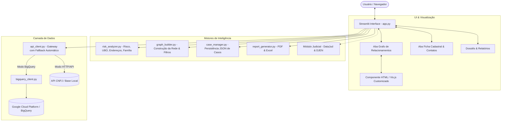

# 🍊 POMELO (CAEXLGS) — Documentação Técnica & Arquitetura do Sistema

> **Plataforma de Inteligência Societária, Redes Complexas (Grafos Interativos) e Compliance Forense.**

---

## 1. Visão Geral Executiva

O **POMELO** é uma solução de inteligência forense e patrimonial para análise e investigação de vínculos empresariais, societários e de contatos a partir dos dados públicos da Receita Federal do Brasil (RFB), combinados com motores heurísticos de risco, detecção de beneficiário final (UBO) e visualização de grafos de relacionamento em rede interativa.

A aplicação opera em dois modos principais:
1. **Modo Sigilo Total (Google BigQuery Privado):** As consultas rodam diretamente na infraestrutura GCP do próprio usuário/órgão investigador, sem que nenhum termo de busca ou documento saia do perímetro de segurança da organização.
2. **Modo Autônomo / Fallback Público:** Conexão nativa com endpoints REST da API CNPJ (`https://api.cnpj.pw`), permitindo execução imediata sem necessidade de configuração prévia de credenciais de nuvem.

---

## 2. Arquitetura do Sistema

O sistema foi concebido com separação rigorosa de responsabilidades (Clean Code / SRP):



---

## 3. Módulos do Sistema

### 3.1 `app.py` (Orquestrador da Aplicação)
* **Localização:** `C:\pomelo\cnpjpw\local_app\app.py` (e launcher raiz `C:\pomelo\app.py`).
* **Responsabilidade:** Controle de fluxo, gerenciamento de estado (`st.session_state`), renderização da barra lateral de navegação e orquestração de chamadas aos motores.
* **Telas principais:**
  * `HOME`: Busca Simples (CNPJ, Razão Social, Sócio por CPF/Nome, Telefone, E-mail).
  * `ADVANCED`: Busca Avançada com filtros múltiplos (CNAE, Município, UF, Natureza Jurídica, Capital Social, Simples/MEI).
  * `RESULTS`: Listagem de resultados encontrados com atalhos de abertura direta e em nova aba (`?cnpj=...` ou `?socio=...`).
  * `DETAILS`: Exibição detalhada com abas **🕸️ Grafo de Relacionamentos** e **📄 Ficha Cadastral**.

### 3.2 `graph_builder.py` (Motor de Grafos Vis.js)
* **Responsabilidade:** Gera a estrutura de dados (nós e arestas) e compila o container HTML standalone com a biblioteca Vis.js Network.
* **Características do Grafo:**
  * **Comunicação Bidirecional (DOM Event Bridge):** Integração segura via DOM (`window.parent.document`) entre o iframe sandboxed e o Streamlit para disparo imediato de expansões e exclusões de nós sem recarregamento de página.
  * **Interatividade nos Nós:** Menu de ações flutuante nos nós (botão verde **✚** para expandir relações da entidade e botão vermelho **✕** para remover o nó da rede).
  * **Suporte a Duplo Clique:** Duplo clique direto sobre qualquer nó dispara a busca e expansão de suas conexões.
  * **Física com Memória de Posição:** Nós podem ser arrastados livremente e permanecem no local exato onde forem soltos pelo usuário (física desativada após estabilização inicial para evitar efeito "elástico").
  * **Classificação Estrita de Contadores:** Identificação automática por CNAE oficial (69.20) e termos contábeis rigorosos, com proteção ativa contra falsos positivos (ex.: assessorias esportivas ou jurídicas não são rotuladas como contabilidade).
  * **Exportação & Ferramentas:** Botões de Maximizar/Minimizar (Full Window), Centralizar/Enquadrar e Baixar Grafo em PNG de alta resolução.

### 3.3 `risk_analyzer.py` (Motor Forense & Compliance)
* **Score de Risco Cadastral:** Pontuação baseada em situações atípicas (Inapta, Baixada, Suspensa, empresa aberta há menos de 1 ano, capital social desproporcional, ausência de contatos).
* **Rastreamento de UBO (Beneficiário Final):** Algoritmo recursivo que percorre a árvore de participação societária em cascata (empresas que possuem participação em outras empresas) até identificar a pessoa física controladora final.
* **Detecção de Endereços Compartilhados:** Agrupamento por CEP + número de logradouro para apontar possíveis sedes fictícias ou empresas de fachada.
* **Detecção de Grupos Familiares:** Análise de sobrenomes entre os sócios para mapear vínculos de parentesco.

### 3.4 `api_client.py` & `bigquery_client.py` (Camada de Dados)
* **Modo AUTO:** Verifica automaticamente a disponibilidade de credenciais do Google Cloud (`gcp-key.json` ou variável de ambiente). Se configurado, executa queries de alta performance no BigQuery; caso contrário, redireciona de forma transparente para a API REST sem interromper a navegação.
* **Buscas Reversas:**
  * `buscar_empresas_do_socio(nome, doc)`
  * `buscar_telefone(ddd, telefone)`
  * `buscar_email(email)`
  * `busca_difusa(params)`

### 3.5 `case_manager.py` (Persistência de Casos)
* Permite salvar e carregar projetos investigativos completos em formato `.json`.
* Preserva nós manuais criados pelo analista, arestas manuais, nós excluídos, anotações de parecer técnico e lista de falsos positivos desmarcados.

### 3.6 `report_generator.py` (Dossiês Executivos)
* **Dossiê em PDF:** Relatório formal pronto para instrução de processos ou relatórios de auditoria, contendo dados da matriz, quadro societário, parecer do analista, indicadores de risco e matriz de conexões.
* **Planilha em Excel (`.xlsx`):** Dados estruturados em múltiplas abas com formatação profissional.

---

## 4. Legenda Visual do Grafo

| Elemento | Cor / Ícone | Descrição |
| :--- | :--- | :--- |
| **Empresa Raiz** | 🔵 Azul Escuro (`#0D47A1`) | Empresa principal sob investigação |
| **Empresa Vinculada** | 🔷 Azul Médio (`#1976D2`) | Empresa conectada por sócio, telefone ou e-mail |
| **Empresa de Risco** | 🔴 Vermelho (`#D32F2F`) | Situação Baixada, Inapta, Nula ou Suspensa |
| **Sócio (Pessoa Física)** | 👤 Laranja (`#E65100`) | Administrador, sócio ou titular |
| **Beneficiário Final (UBO)** | 👑 Dourado (`#FBC02D`) | Pessoa física controladora no topo da cadeia |
| **Contador / Escritório** | 🧮 Verde Petróleo (`#00897B`) | Entidade com CNAE 69.20 ou identificação contábil |
| **Telefone Compartilhado** | 📞 Roxo (`#7B1FA2`) | Telefone que conecta duas ou mais empresas |
| **E-mail Compartilhado** | ✉️ Verde (`#2E7D32`) | Endereço de e-mail corporativo ou pessoal compartilhado |
| **Endereço Compartilhado** | 📍 Ciano (`#00838F`) | Mesmo CEP e número predial compartilhado |
| **Entidade Manual (PF/PJ)** | 🌸 Magenta (`#D81B60` / `#880E4F`) | Inserida manualmente pelo analista na investigação |

---

## 5. Como Executar o Aplicativo

### Execução Local (Windows):
```powershell
# Iniciar pelo launcher raiz:
streamlit run app.py
```
Ou simplesmente dê dois cliques no arquivo executável em lote: `iniciar_app.bat`.

### Execução Online com Acesso Externo Seguro (Cloudflare Tunnel):
```powershell
# Iniciar o servidor Streamlit
streamlit run app.py --server.port 8501 --server.headless true

# Iniciar o túnel seguro na porta 8501
.\cloudflared.exe tunnel --url http://localhost:8501 --no-autoupdate
```

---

## 6. Suíte de Testes Automatizados

Para validar todos os testes unitários e de integração da suíte:
```powershell
python -m unittest discover -s cnpjpw/tests -p "test_*.py"
```
* **Total de Testes:** 27 testes cobrindo geradores de grafo, validadores judiciais, analisador de risco, UBO e clientes de API.
