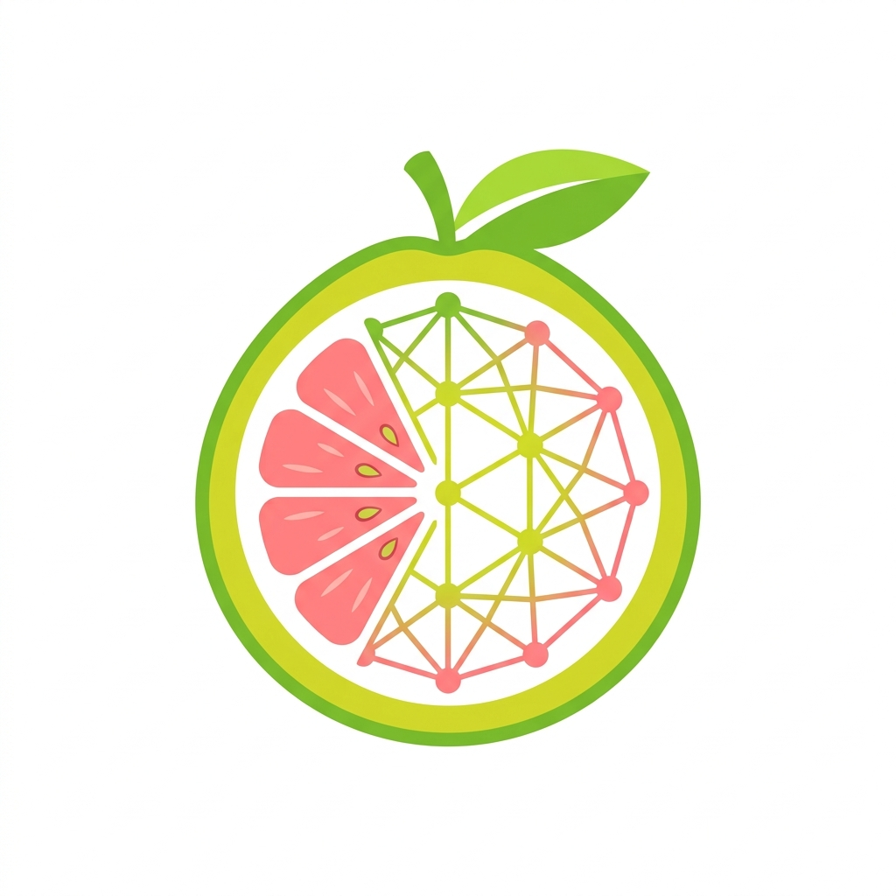

# 🍊 POMELO (CAEXLGS) — Inteligência Societária, Grafos e Compliance Judicial

<div align="center">
  
  <p><b>Inteligência Forense de Vínculos Societários, Redes e Processos Judiciais</b></p>
</div>

[](https://www.python.org/)
[](https://streamlit.io/)
[](https://cloud.google.com/bigquery)
[](https://www.cnj.jus.br/sistemas/datajud/api-publica/)
[](LICENSE)

Plataforma avançada para **consulta de dados abertos da Receita Federal**, rastreamento de **Processos Judiciais (DataJud & DJEN)**, mapeamento em **Grafos Interativos de Relacionamento**, detecção de **Grupos Familiares**, rastreamento de **Beneficiário Final (UBO)**, análise de **Risco e Compliance** e emissão de **Dossiês Investigativos em PDF e Excel**.

---

## ⚡ Funcionalidades Principais

* **⚖️ Inteligência Judicial (DataJud & DJEN):** Consultas em tempo real de ações judiciais por **CNPJ, CPF, Razão Social, Nome de Pessoa Física ou Número Único CNJ**, integrando os índices abertos do DataJud e o Diário de Justiça Eletrônico Nacional (ComunicaAPI).
* **🔗 Vinculação Documento ↔ Processo:** Mapeamento bidirecional qualificando se a pessoa física ou jurídica é **Autora (Polo Ativo)** ou **Ré / Executada (Polo Passivo)**, com cálculo de risco e histórico de movimentações.
* **🕸️ Nós de Processos no Grafo Interativo (`Vis.js`):** Conexão visual direta dos processos aos nós de empresas e sócios, destacando ações com arestas verdes (Autora) ou vermelhas pontilhadas (Ré).
* **🔒 Modo Sigilo Total (Google BigQuery):** Consultas diretas no seu próprio projeto privado do Google Cloud, sem enviar nenhum dado para servidores ou APIs de terceiros.
* **🚫 Filtro e Exclusão de Contadores:** Remoção automática e manual de escritórios contábeis e ruídos de rede para evitar conexões falsas entre empresas independentes.
* **⭐ Inserção Manual de Inteligência:** Capacidade de adicionar pessoas físicas/jurídicas e desenhar vínculos manuais em destaque com rótulos investigativos (ex.: *Operador de Fato*, *Laranja*, *Parentesco*).
* **🚨 Alertas de Risco & Situação Cadastral:** Destaque visual em vermelho para empresas **Inaptas, Baixadas, Suspensas** e empresas recém-abertas (< 1 ano).
* **📍 Vínculos por Endereço Compartilhado:** Identificação de clusters operando no mesmo CEP + Número de logradouro (detecção de empresas de fachada e sedes virtuais).
* **👑 Beneficiário Final (UBO):** Algoritmo recursivo que rastreia participações societárias em cascata (PJ dona de PJ) até a Pessoa Física controladora no topo.
* **👨‍👩‍👧 Detecção de Parentesco:** Clusterização automática por sobrenomes em comum.
* **📑 Dossiês em PDF, Excel & JSON:** Exportação com 1 clique de relatórios executivos formais, planilhas estruturadas e dossiê de vínculos judiciais.
* **💾 Persistência de Casos (JSON):** Salve e carregue projetos de investigação completos para retomar o trabalho a qualquer momento.

---

## 🚀 Como Começar

### 📖 Guia de Instalação Passo a Passo para Leigos:
👉 **Consulte o [GUIA_INSTALACAO.md](GUIA_INSTALACAO.md)** para um passo a passo detalhado e ilustrado, ideal para quem nunca mexeu com Python ou linha de comando.

---

### ⚡ Instalação Rápida (Para Desenvolvedores):

1. **Clone o repositório:**
   ```bash
   git clone https://github.com/naussen/caexlgs.git
   cd caexlgs
   ```

2. **Instale os pré-requisitos:**
   ```bash
   pip install -r cnpjpw/local_app/requirements.txt
   ```

3. **Inicie o aplicativo:**
   - No Windows: dê dois cliques em `iniciar_app.bat` ou rode:
   ```bash
   streamlit run cnpjpw/local_app/app.py
   ```

4. Acesse no navegador: `http://localhost:8501`

---

## 🛡️ Segurança & Privacidade

O projeto foi desenhado segundo os mais rigorosos princípios de privacidade para investigações patrimoniais e compliance:
* Nenhuma anotação, parecer, nó manual ou dado de investigação sai da memória do seu computador.
* As consultas ao BigQuery utilizam sua própria Service Account e projeto pessoal no Google Cloud Platform.
* As chaves de acesso (`gcp-key.json`) e arquivos temporários são estritamente ignorados pelo `.gitignore` e nunca são versionados.

---

## 📄 Licença

Distribuído sob a licença MIT. Consulte o arquivo `LICENSE` para mais detalhes.
